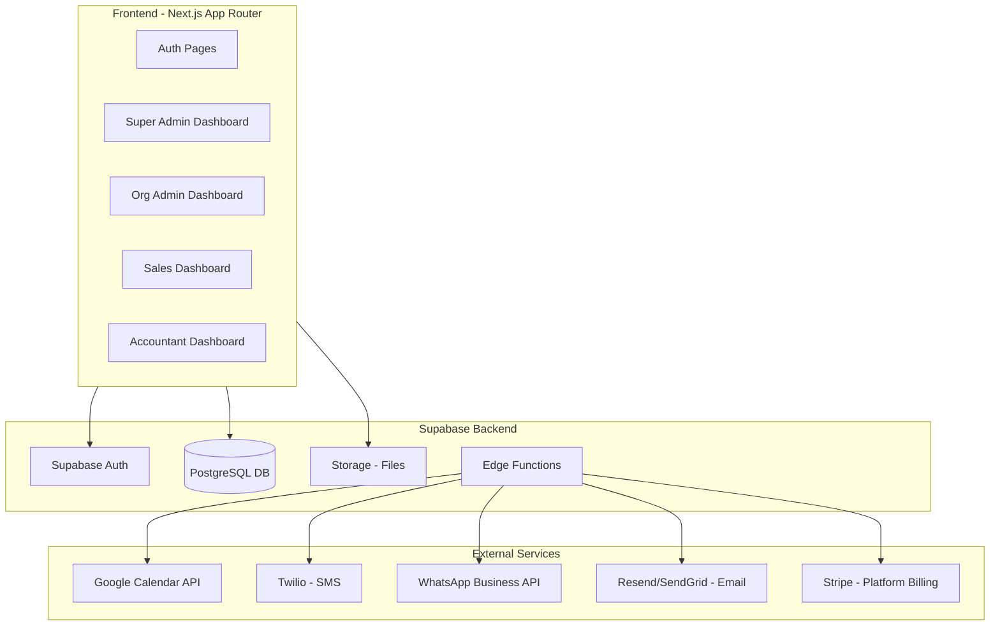
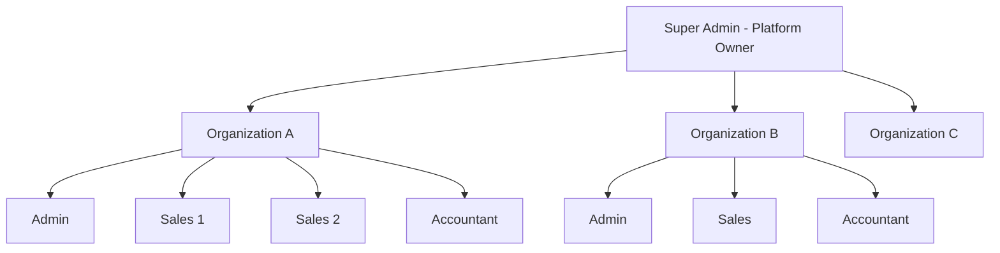
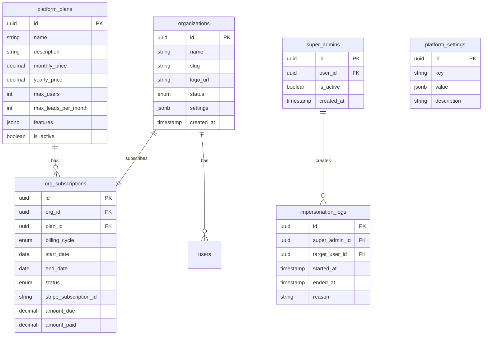
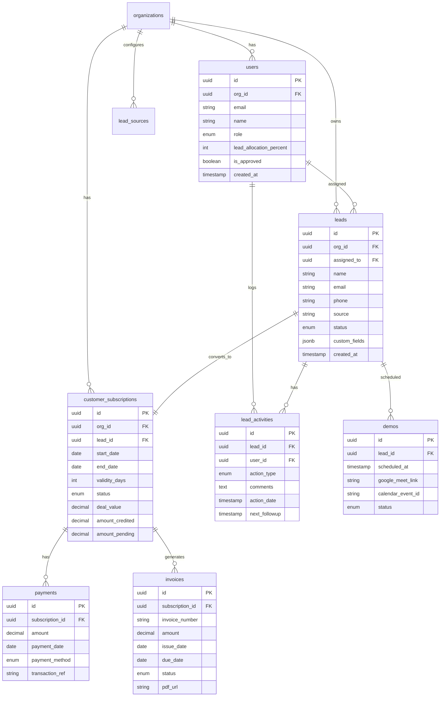
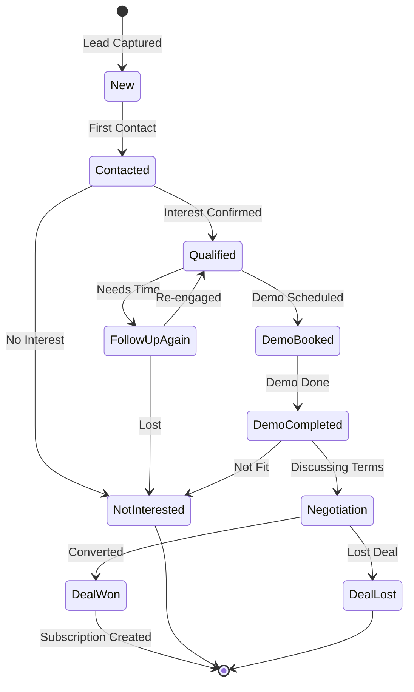

# Lead Management CRM - Implementation Plan

## Overview

A multi-tenant SaaS Lead Management CRM with Super Admin platform management, built with Next.js and Supabase. Features 4 roles (Super Admin, Admin, Sales, Accountant), lead capture with platform integrations, opportunity pipeline, demo scheduling with Google Meet, subscription tracking, and full finance capabilities.

---

## Architecture Overview



---

## Role Hierarchy



**4 Roles:**

1. **Super Admin (You)** - Platform owner, manages all organizations, billing, can impersonate any user
2. **Admin** - Organization administrator, manages their org's users, leads, integrations
3. **Sales** - Sales team member, works on assigned leads, schedules demos
4. **Accountant** - Finance role, manages payments, invoices, reminders

---

## Database Schema Design (Multi-Tenant SaaS)

### Platform-Level Tables (Super Admin)



### Organization-Level Tables (Tenants)



---

## Role-Based Features Matrix

| Feature | Super Admin | Admin | Sales | Accountant |
|---------|-------------|-------|-------|------------|
| **Platform Management** |
| Create/Approve/Suspend Orgs | Yes | No | No | No |
| Manage Platform Plans | Yes | No | No | No |
| View All Orgs Data | Yes | No | No | No |
| Impersonate Users | Yes | No | No | No |
| Global Analytics | Yes | No | No | No |
| Platform Settings | Yes | No | No | No |
| Platform Billing | Yes | No | No | No |
| **Organization Management** |
| User Management (Approve/Delete) | Yes | Yes | No | No |
| Lead Import (CSV/XLSX) | Yes | Yes | Yes | No |
| Platform Integration Setup | Yes | Yes | No | No |
| View All Org Leads | Yes | Yes | Assigned Only | No |
| Lead Assignment (% Allocation) | Yes | Yes | No | No |
| Update Lead Status | Yes | Yes | Yes | No |
| Schedule Demos | Yes | Yes | Yes | No |
| View Subscriptions | Yes | Yes | Yes | Yes |
| Manage Payments | Yes | No | No | Yes |
| Generate Invoices | Yes | No | No | Yes |
| Financial Reports | Yes | Yes | No | Yes |
| Send Payment Reminders | Yes | No | No | Yes |

---

## Lead Pipeline Workflow



---

## Project Structure

```
crm/
├── src/
│   ├── app/                          # Next.js App Router
│   │   ├── (auth)/                   # Auth pages (login, register, forgot-password)
│   │   ├── (super-admin)/            # Super Admin platform management
│   │   │   ├── organizations/        # Org CRUD, approval, suspension
│   │   │   ├── platform-plans/       # Pricing plans management
│   │   │   ├── platform-billing/     # Org subscription billing
│   │   │   ├── global-analytics/     # Cross-org analytics
│   │   │   ├── settings/             # Platform settings, feature flags
│   │   │   └── impersonate/          # User impersonation
│   │   ├── (dashboard)/              # Protected org dashboard routes
│   │   │   ├── [orgSlug]/            # Dynamic org routing
│   │   │   │   ├── admin/            # Org Admin pages
│   │   │   │   ├── sales/            # Sales pages
│   │   │   │   └── accountant/       # Accountant pages
│   │   ├── api/                      # API routes
│   │   └── layout.tsx
│   ├── components/
│   │   ├── ui/                       # Reusable UI (shadcn/ui)
│   │   ├── platform/                 # Super Admin components
│   │   ├── leads/                    # Lead components
│   │   ├── subscriptions/            # Subscription components
│   │   └── finance/                  # Invoice, payment components
│   ├── lib/
│   │   ├── supabase/                 # Supabase client & helpers
│   │   ├── google-calendar/          # Google Calendar integration
│   │   ├── stripe/                   # Stripe billing integration
│   │   └── notifications/            # Email, SMS, WhatsApp helpers
│   ├── hooks/                        # Custom React hooks
│   └── types/                        # TypeScript types
├── supabase/
│   ├── migrations/                   # Database migrations
│   └── functions/                    # Edge functions
└── public/
```

---

## Implementation Phases

### Phase 1: Foundation (Week 1-2)
- Supabase project setup with multi-tenant SaaS schema
- Next.js project with App Router, TypeScript, Tailwind CSS
- Authentication flow with Supabase Auth
- 4-role system (Super Admin, Admin, Sales, Accountant)
- Role-based middleware and authorization
- Organization onboarding flow

### Phase 2: Super Admin Platform Management (Week 2-3)
- Super Admin dashboard and authentication
- Organization CRUD (create, approve, suspend, delete)
- Platform plans management (pricing tiers, features, limits)
- Organization subscription management (billing cycles, status)
- User impersonation system with audit logging
- Global analytics dashboard (total orgs, leads, conversions)
- Platform settings (branding, feature flags)
- Stripe integration for platform billing

### Phase 3: Lead Management Core (Week 3-4)
- Lead database tables and RLS policies
- CSV/XLSX upload with parsing (Papa Parse, SheetJS)
- Manual lead entry forms
- Lead listing with filters, search, pagination
- Lead assignment with percentage allocation algorithm
- Lead detail view with activity timeline

### Phase 4: Opportunity Pipeline (Week 4-5)
- Kanban board view for lead statuses
- Status update with comments and action dates
- Auto-routing to Follow-up/Demo tabs based on status
- Demo scheduling UI
- Google Calendar API integration for Meet links
- Demo management (reschedule, cancel, mark complete)

### Phase 5: Subscription Management (Week 5-6)
- Customer subscription creation from "Deal Won" leads
- Validity periods (30, 90, 180, 365 days)
- Auto-calculated end dates and days remaining
- Subscription status auto-update (Active, Expiring Soon, Expired)
- Subscription listing and detail views

### Phase 6: Finance Module (Week 6-7)
- Payment recording and tracking
- Amount credited vs pending calculations
- Invoice generation (PDF with company branding)
- Invoice listing and management
- Payment reminders (scheduled notifications)
- Financial reports and dashboards

### Phase 7: Notifications (Week 7-8)
- Email notifications via Resend/SendGrid
- SMS notifications via Twilio
- WhatsApp notifications via WhatsApp Business API
- Notification triggers: follow-up reminders, demo reminders, subscription expiry, payment due
- Notification preferences per user

### Phase 8: Platform Integrations (Week 8-9)
- Webhook endpoints for Facebook/Instagram Lead Ads
- LinkedIn Lead Gen Forms integration
- WhatsApp Business API for lead capture
- Lead source tracking and attribution
- Integration configuration UI for admins

### Phase 9: Polish and Testing (Week 9-10)
- Dashboard analytics and charts
- Performance optimization
- Mobile responsiveness
- End-to-end testing
- Documentation

---

## Key Technology Choices

| Component | Technology | Reason |
|-----------|------------|--------|
| Frontend | Next.js 14 (App Router) | Server components, API routes, great DX |
| UI Components | shadcn/ui + Tailwind CSS | Beautiful, customizable, accessible |
| Database | Supabase (PostgreSQL) | Built-in auth, RLS, real-time, storage |
| Platform Billing | Stripe | Industry standard, webhooks, subscriptions |
| File Parsing | Papa Parse + SheetJS | CSV and XLSX handling |
| Calendar | Google Calendar API | Google Meet link generation |
| Email | Resend | Modern email API, good deliverability |
| SMS | Twilio | Reliable, global coverage |
| WhatsApp | WhatsApp Business API | Official API for business messaging |
| PDF Generation | @react-pdf/renderer | React-based PDF creation |
| Charts | Recharts | Composable React charts |

---

## Super Admin Features Detail

### Organization Management
- **Create Organization**: Manually onboard new clients with details
- **Approve/Reject**: Review pending organization registrations
- **Suspend**: Temporarily disable access (non-payment, violations)
- **Delete**: Permanently remove organization and all data

### Platform Subscription Plans
Define pricing tiers with limits:
- **Starter**: X users, Y leads/month, basic features
- **Professional**: More users, leads, advanced features
- **Enterprise**: Unlimited, all features, priority support

### User Impersonation
- Login as any user for support/debugging
- All impersonation sessions logged with timestamps
- Reason field required for audit trail
- Visual indicator showing impersonation mode

### Global Analytics Dashboard
- Total organizations (active, suspended, churned)
- Total users across platform
- Total leads processed
- Revenue metrics (MRR, ARR, churn rate)
- Top performing organizations

### Platform Settings
- Branding (logo, colors, company name)
- Feature flags (enable/disable features globally)
- Default organization settings
- Notification templates

---

## Multi-Tenant SaaS Architecture Notes

1. **Two-Level Data Model**:
   - Platform level: Super Admin, platform plans, organization subscriptions
   - Tenant level: Organization data (users, leads, customer subscriptions)

2. **Row Level Security (RLS)**:
   - Super Admin bypasses tenant RLS for support access
   - Regular users only access their organization's data
   - Impersonation uses RLS with audit logging

3. **Organization Context**: 
   - Context provider manages current organization
   - URL-based routing: `/[orgSlug]/dashboard`

4. **Data Isolation**: Complete isolation between tenants at database level

5. **Super Admin Access Pattern**:
   - Separate auth check for super admin routes
   - Global data access for analytics and support
   - Impersonation creates temporary session with target user context

---

## Questions Resolved

- Tech: Next.js + Supabase
- Lead capture: Hybrid (manual now, webhooks later)
- Calendar: Google Calendar API via Cloud Console
- Notifications: Email + SMS + WhatsApp
- Invoice: Format TBD (templating system ready)
- Architecture: Multi-tenant SaaS with Super Admin layer
- Super Admin: Full platform management, impersonation, global analytics, Stripe billing

